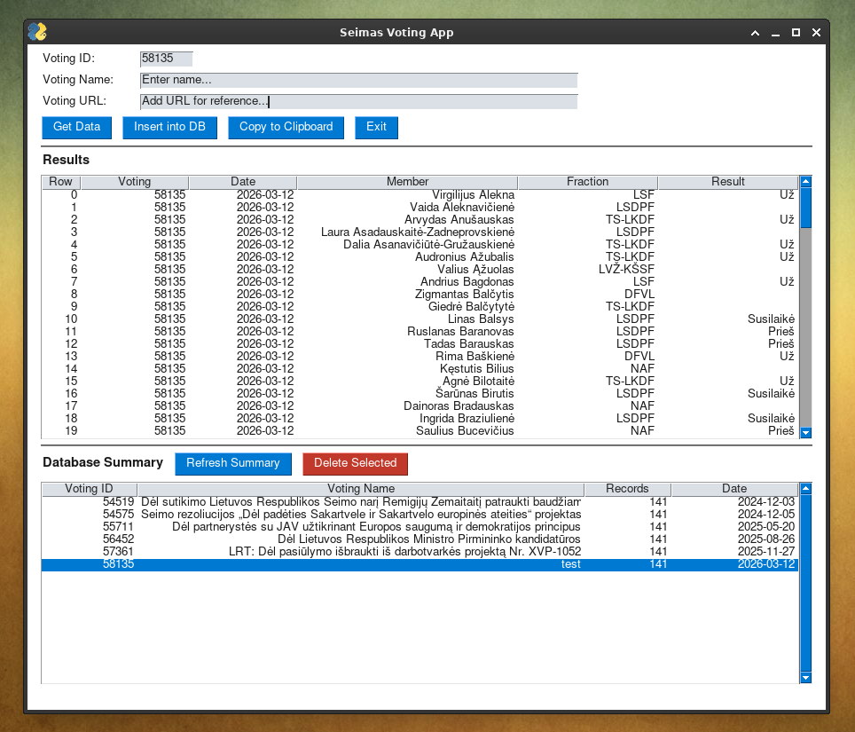

# Seimas Voting Scraper



A Python desktop application for scraping, structuring, and managing selected parliamentary voting records from the Lithuanian Seimas public API. Provides a GUI front-end for entering data into Google Sheets. Intended to be used with Looker Studio for reporting.

---

## Overview

Built to serve a personal need — structured data entry from a public government API into a Google Sheets database. Shared here in case it inspires similar civic data projects. The app fetches voting records for a given voting ID, displays them for review, and inserts them into a three-sheet Google Sheets structure alongside the vote name and source URL.
---

## Features

- **API data fetch** — retrieves individual voting records from the Seimas public API by voting ID
- **Preview before insert** — results are displayed in a table for review before committing to the database
- **Duplicate detection** — warns before inserting a vote ID that already exists in the database
- **Database summary** — shows record count per vote ID with vote name and date, loaded on startup
- **Delete voting** — removes all records for a selected vote from all three sheets in a single batch operation (avoids Google Sheets API quota limits)
- **Copy to clipboard** — tab-separated export for pasting directly into other tools
- **Refresh summary** — reloads the database summary on demand

---

## Requirements

```
Python 3.9+
FreeSimpleGUI
gspread
google-auth
requests
pandas
```

Install dependencies:

Developed and tested on Linux. FreeSimpleGUI rendering may vary slightly by OS.

---

## API Note

The Seimas voting API (`apps.lrs.lt`) may be inaccessible from non-Lithuanian IP addresses. If requests time out or return connection errors, try connecting via a Lithuanian VPN.

---

## Google Sheets Setup

The app writes to a spreadsheet named `your_spreadsheet` across three sheets:

| Sheet | Index | Contents |
|---|---|---|
| Sheet 1 | 0 | Voting records (voting ID, date, member, fraction, result) |
| Sheet 2 | 1 | Vote names (voting ID, voting name) |
| Sheet 3 | 2 | Vote URLs (voting ID, voting URL) |

1. Create a Google Cloud project and enable the Sheets and Drive APIs
2. Create a service account and download the JSON credentials file
3. Share the spreadsheet with the service account email address
4. Update `CREDENTIALS_PATH` in the script:

```python
CREDENTIALS_PATH = '/path/to/your/credentials.json'
SPREADSHEET_NAME = 'your_spreadsheet'  # rename to whatever works for you
```

---

## Data Structure

**Sheet 1 — Voting records**

| Field | Description |
|---|---|
| `voting` | Vote ID from the Seimas API |
| `date` | Date of the vote (YYYY-MM-DD) |
| `member` | MP full name |
| `fraction` | Parliamentary fraction/party |
| `result` | Vote cast (e.g. už / prieš / susilaikė) |

**Sheet 2 — Vote names**

| Field | Description |
|---|---|
| `voting` | Voting ID |
| `voting_name` | Descriptive name of the vote |

**Sheet 3 — Vote URLs**

| Field | Description |
|---|---|
| `voting` | Voting ID |
| `voting_url` | Source URL for reference |

---

## Usage

1. Enter a **Voting ID** (visible in the URL when browsing lrs.lt)
2. Click **Get Data** to fetch and preview the records
3. Enter the **Voting Name** and optionally the **Voting URL**
4. Click **Insert into DB** to write to Google Sheets
5. The database summary updates automatically after each insert

To remove a voting records, select it in the Database Summary table and click **Delete Selected**. This removes all matching rows from all three sheets in a single operation.

---

## License

MIT
