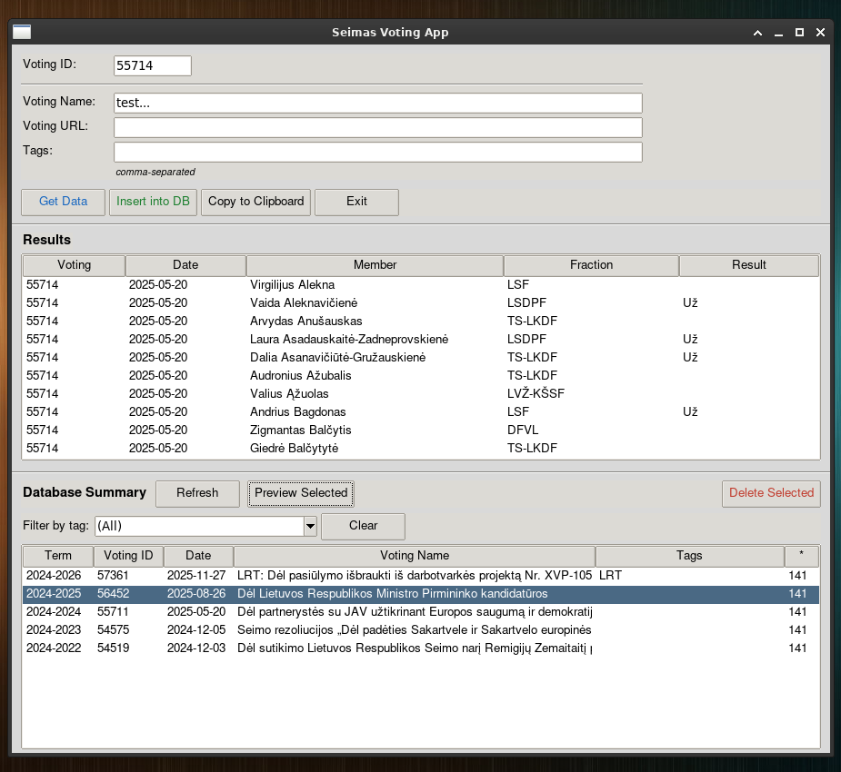
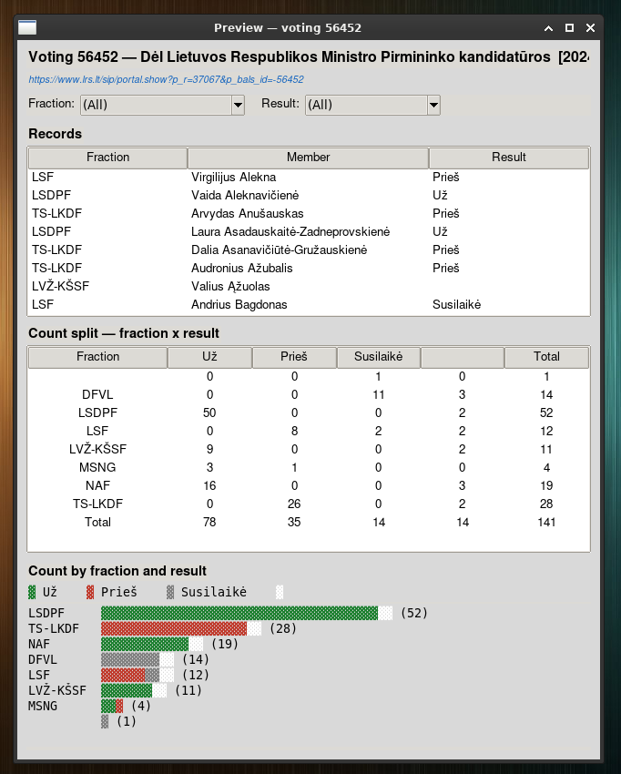

# Seimas Voting Scraper

A Python desktop app for scraping, structuring, and managing selected parliamentary voting records from the Lithuanian Seimas public API. Provides a Tkinter GUI for entering data into Google Sheets, intended for use with Data Studio for reporting.

Built to serve a personal need. Shared here in case it inspires similar civic data projects.

<p align="left">
  
  
</p>

## Requirements

```
Python 3.9+
gspread
google-auth
requests
pandas
```


---

## API Note

The API (`apps.lrs.lt`) may be inaccessible from non-Lithuanian IP addresses.

---

## Google Sheets Setup

1. Create a Google Cloud project and enable the Sheets and Drive APIs
2. Create a service account and download the JSON credentials file
3. Share the spreadsheet with the service account email address
4. Update the config constants near the top of **`sheets.py`**:

Exact header rows are expected. The schema is verified at startup:

- **Sheet 1** (fact table): `voting`, `date`, `member`, `fraction`, `result`
- **Sheet 2** (dimensions): `voting`, `term`, `votingname`, `votingurl`, `tags`

---

## License

MIT - do whatever you like
